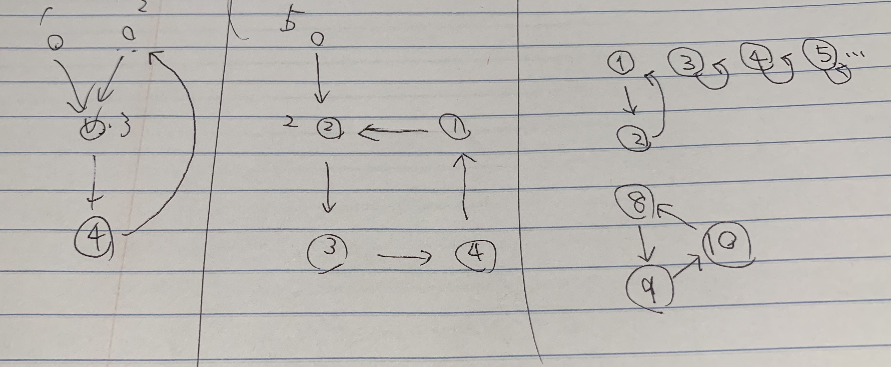

# Overview

Algorithm questions and solutions

### Q: CyclicPermutation

```
There are several ways to represent a permutation of N integers from 1 to N. For example, a permutation of 8 elements (3, 2, 7, 8, 1, 4, 5, 6) can be represented as ...

Alternatively, it can be represented as a directed graph below.
As shown in the graph above, there are three cycles. (permutation cycles).
Given a set of N integer elements, write a program that finds the number of cycles.

Input Specification
First line: the number of test cases T
In the first row of each test case, the size N of the permutation (2 <= N <= 1000) is given. The second row of each test case will have a permutation of N integers. (space-separated)

Output Specification
For each test case, output the number of permutations cycles.

Sample Input 1
2
8
3 2 7 8 1 4 5 6
10
2 1 3 4 5 6 7 9 10 8
Sample Output 1
3
```

NOTION: example


### Q: RepeatingSequence

```
There’s a sequence defined as follows:
D[1] = A
D[N] = the sum of (each digit of D[N-1])P

For example, A = 57 and P = 2 then
D[1] = 57
D[2] = 52 + 72 = 74
D[3] = 72 + 42 = 65
D[4] = 62 + 52 = 61
D[5] = 62 + 12 = 37
…

So the sequence D is {57, 74, 65, 61, 37, 58, 89, 145, …, 16, 37, …  }. If you continue to search for such a sequence, you will find a repeating sequence.
Write a program that counts the number of integers in the sequence that are not part of the repeating sequence. In the example above, the four numbers {57, 74, 65, 61} are left.

Input Specification
On the first line, A (1 <= A <= 9999) and P (1 <= P <= 5)

Output Specification
The number of integers that are not part of the repeating sequence.

Sample Input 1
57 2
Sample Output 1
4
```

## LICENSE

MIT
